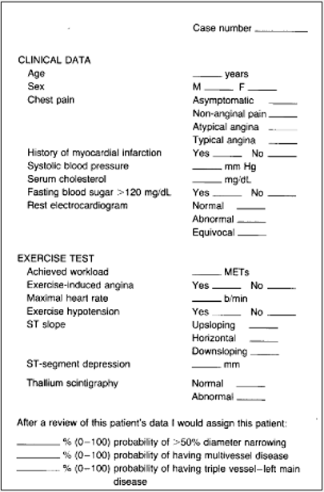

```{r setup, include=FALSE}
knitr::opts_chunk$set(echo = TRUE)
```

# Introduction

Heart disease is the leading cause of death in New Zealand accounting for almost 1 in 3 fatalities. A New Zealander dies from heart disease every 90 minutes with many of these deaths being preventable [1]. Understanding the clinical variables that make people vulnerable to heart disease is crucial to implementing effective prevention strategies and informing policy decisions.

The data we used for this report contains observations of 270 patients who have been referred for coronary angiography at Cleveland Clinic in Cleveland, Ohio. Given that they have been referred for further testing we know that each of these patients have been determined to have some possible indications of heart disease. Patients were diagnosed with heart disease if they had more than 50% diameter narrowing of a coronary artery.[2]

The article “Clinical Assessment of the Probability of Coronary Artery Disease: Judgemental Bias from Personal Knowledge”[3] assessed the bias of physicians when basing probability of heart disease on personal knowledge. The study consisted of 510 patients in Long Beach California referred for the first time for coronary angiography. Presented with case summaries of these patients (Figure 1) physicians were asked to estimate the probability of that patient having heart disease. The variables used in this study are almost the same as those in the Cleveland dataset with three additional variables; “History of myocardial infarction”,  “Achieved workload” and, “Exercise hypotension”. The results showed that the physicians consistently overestimated the probability of coronary artery disease. This indicates that relying solely on the personal knowledge of physicians may not be adequate for prediction of heart disease.


{width=40%}


This leads to our research questions:
1. Using empirical techniques, can we accurately predict whether heart disease is present based on clinical variables?​
2. How does sex and heart disease presence interact? Are there significant differences in predicting the presence of heart disease in females compared to males? ​

In order to answer these questions we first investigated the data using Exploratory Data Analysis. We then used Linear Discriminant Analysis and Bayesian classification using Gaussian models to evaluate the accuracy of our model in predicting the presence of Heart Disease. We then repeated this now using interaction between sex and heart disease to examine how this changes the accuracy of the model and whether the sensitivity and specificity of the model differs between classes.


(The Dataset and Variables sections will be under Methodology)


## The Dataset

Our dataset "Heart_Disease_Prediction" was created by Andras Janosi, William Steinbrunn, Matthias Pfisterer and Robert Detrano and was donated to the University of California Irvine data repository[4]. It was made publicly available by Robert Hoyt MD and can be found at  [link](https://data.world/informatics-edu/heart-disease-prediction). The original database contained 76 attributes but the published data uses a subset of just 14 of these attributes.


## Variables

The variables in our dataset can be catergorised into Clinical Data and Stress Test Data.
Clinical Data are those which could be observed or measured at a local GP clinic. Stress Test Data are observations taken to measure the ability of the heart to pump blood under increased stress conditions, usually this is during exercise using a treadmill or stationary bicycle.

#### Clinical Data:

* Age (*numeric*): The age of the patient
* Sex (*categorical*): Sex of the patient (0 = Female, 1 = Male)
* Chest pain type (*categorical*): Type of chest pain experienced by the patient (1 = Typical angina, 2 = Atypical angina, 3 = Non-anginal pain, 4 = Asymptomatic)
* BP (*numeric*): The blood pressure level of the patient in mmHg
* Cholesterol (*numeric*): The cholesterol level of the patient in mg/dl
* FBS over 120 (*categorical*): Fasting blood sugar test results are over 120 mg/dl (0 = False, 1 = True)
* EKG results (*categorical*): Resting electrocardiographic results (0 = normal, 1 = having ST-T wave abnormality, 2 = Showing Probable or Definite Left Ventricular Hypertrophy by Estes' Criteria)


#### Stress Test Data:

* Exercise Angina (*categorical*): Patient experiences exercise-induced angina (0 = False, 1 = True)
Max HR (*numeric*): The maximum heart rate levels achieved during exercise testing in bpm
* Slope of ST (*categorical*): Slope of the peak exercise ST segment (1 = Upsloping, 2 = Flat, 3 = Downsloping)
* ST depression (*numeric*): The ST(Stress Test) depression on an Electrocardiogram induced by exercise relative to rest in mm
* Thallium (*categorical*): Thallium Stress test finding (3 = Normal, 6 = Fixed defect, 7 = Reversible defect)


In our analysis we took a subset of six of these variables focusing on clinical data.

These six variables were:
* Age​
* Sex​
* BP (Blood Pressure​)
* Cholesterol​
* Max HR (Maximum Heart Rate​)
* Chest Pain Type 


## Citations

[1] Ministry of Heath 2021. Custom requested mortality dataset provided to Heart Foundation from the NZ Mortality Collection. August 2021

[2] Detrano, R., Janosi, A., Steinbrunn, W., Pfisterer, M., Schmid, J. J., Sandhu, S., Guppy, K. H., Lee, S., & Froelicher, V. (1989). International application of a new probability algorithm for the diagnosis of coronary artery disease. *The American journal of cardiology*, 64(5), 304–310. https://doi.org/10.1016/0002-9149(89)90524-9

[3] Bobbio, M., Detrano, R., Shandling, A. H., Ellestad, M. H., Clark, J., Brezden, O., Abecia, A., & Martinez-Caro, D. (1992). Clinical Assessment of the Probability of Coronary Artery Disease: Judgmental Bias from Personal Knowledge. *Medical Decision Making*, 12(3), 197–203. https://doi.org/10.1177/0272989X9201200305


[4] Janosi,Andras, Steinbrunn,William, Pfisterer,Matthias, and Detrano,Robert. (1988). Heart Disease. UCI Machine Learning Repository. https://doi.org/10.24432/C52P4X.
